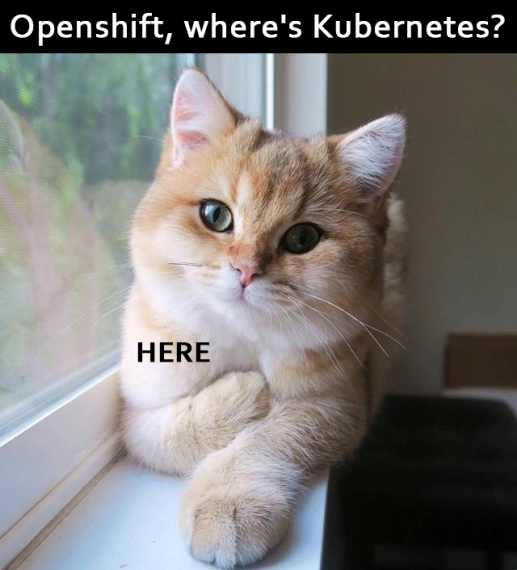

name: section
class: center, middle, inverse
count: false
---
name: background
layout: true
background-image: url(imgs/back.png)
---
template: section
# Cloud-native Python
### Adventures with OpenShift

.footnote[Vadim Rutkovsky <vrutkovs@redhat.com>]
---
class: center, middle

???
* Enterprise Kubernetes, developer-focused
* Forked from Kubernetes codebase, regularly synced with upstream (3 month delay)
* Not an overlay over k8s and not an additional layer of abstraction
* Additional k8s objects - ImageStream, BuildConfigs, DeploymentConfigs
* Origin - upstream version, Openshift Container Platform - enterprise version
* OCP versions are supported for 2 years
---
class: center, middle

???
* Fedora / CentOS / RHEL (incl. Atomic)
* Container Runtime - Docker / CRI-O
* Software Defined Networking
* Build / Deployment Automation

---
## Components

* **Master** - control plane, includes API server and controller manager
* **Node** - provides runtime (docker / crio) for container
* **Etcd** - highly-available key-value storage for all API objects

### Objects

* **Pod** - a set of containers, which share a resource
* **Replica Set** - ensures that a required number of pods is running
* **Deployment** - describes a desired state of deployment, creates Replica Sets
* **ConfigMap** / **Secret** - stores configuration to be consumed by a pod
* **Service** - an internal load balancer for a set of pods
* **Route** - exposes a Service outside of the cluster
* **Namespace** - provides a scope for thje resources in the cluster
---
# Getting Started

`oc` - openshift's command line client. Get it at https://www.openshift.org/download.html

Setting up the local containerized cluster:
```terminal
$ sudo oc cluster up
Starting OpenShift using openshift/origin:v3.7.0 ...
OpenShift server started.

The server is accessible via web console at:
    https://127.0.0.1:8443

You are logged in as:
    User:     developer
    Password: <any value>

To login as administrator:
    oc login -u system:admin
```

---
template: section
# Demo
### Source 2 Image
### Builds, DeploymentConfigs
### Routes

???
Cluster: https://console.engint.openshift.com/console/
S2I demo: master branch

```
oc login ...
oc new-project demo
oc new-app --name=demo http://github.com/vrutkovs/openshift-demo
```

Route: http://hello-demo.e8ca.engint.openshiftapps.com/

Webhook: https://github.com/vrutkovs/openshift-demo/settings/hooks/23131808

Custom Dockerfile: custom-dockerfile branch

```
oc new-app --name=demo-custom http://github.com/vrutkovs/openshift-demo#custom-dockerfile
oc create -f route.yaml
```
---
template: section
# Demo
### Jenkins Pipelines

???
Namespace: pipelines

Pipelines branch: jenkins

```
oc new-project pipelines
oc new-app --name=jenkins-pipeline http://github.com/vrutkovs/openshift-demo#jenkins
```
---
template: section
# Microservices
### CatCatGo - a search engine for cat pictures from reddit

https://bit.ly/catcatgo

???
Namespace: CatCatGo
---
# Application Structure

* **Database** - MongoDB

  Stores the title and links

* **Backend** - Flask

  REST interface to the database

* **Frontend** - ReactJS app

  Sends requests to backend and renders the result

* **Scraper** - python app

  Fetches new image links from subreddits, started every 30 mins by OpenShift

---
# Details
  * HTTPS for frontend/backend provided by OpenShift
  * Several replicas for frontend / backend => deployment won't break existing user sessions
  * DB and Scraper settings are stored in ConfigMap
  * Reddit credentials are stored in Secret
  * App status is stored in OpenShift metrics server (Hawkular), displayed by Grafana


---
# Where do I get it?

Openshift Online - https://www.openshift.com/pricing/index.html

Openshift Dedicated - https://www.openshift.com/dedicated/

MiniShift - https://www.openshift.org/minishift/

Bring Your Own Machines - https://docs.openshift.org/latest/install_config/

---
template: section
# Questions?


.footnote[Slides - https://github.com/vrutkovs/slides-cloud-native-python]

.footnote[<span class="fa fa-twitter"></span> <span class="fa fa-github"></span> @vrutkovs]

.footnote[<span class="fa fa-envelope"></span> <vrutkovs@redhat.com>]
